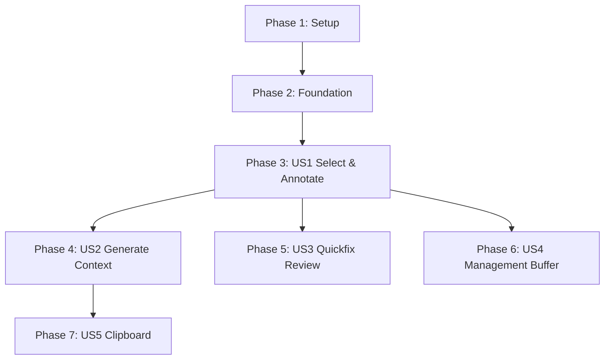

# 実装タスク: コア機能

**ブランチ**: `001-core-features` | **仕様書**: [specs/001-core-features/spec.md](./spec.md) | **計画書**: [specs/001-core-features/plan.md](./plan.md)

このドキュメントは `marginalia.nvim` のコア機能を実装するためのタスクリストです。
すべてのタスクは **テスト駆動開発 (TDD)** の原則に従い、実装の前にテストを作成することを優先します。

---

## フェーズ 1: セットアップ (プロジェクト初期化)

プロジェクトの基本的なディレクトリ構造と、テストインフラを構築します。

- [ ] T001 プロジェクトディレクトリ構造の作成 (`lua/marginalia`, `tests/marginalia` 等)
- [ ] T002 `tests/minimal_init.lua` の作成 (Plenaryテスト用設定)
- [ ] T003 `lua/marginalia/init.lua` の初期化 (スケルトン作成)
- [ ] T004 `lua/marginalia/utils/project.lua` の作成 (プロジェクトルート検出ロジック)
- [ ] T005 [P] `tests/marginalia/project_spec.lua` の作成と `project.lua` のテスト実装

## フェーズ 2: 基盤実装 (データストアと共通モジュール)

データの永続化と管理を行うための基盤モジュールを実装します。これらはユーザー機能の前提条件となります。

**ゴール**: 注釈データの保存と読み込みができる状態にする。

- [ ] T006 [P] `tests/marginalia/store_spec.lua` の作成 (ストアロジックのテスト記述)
- [ ] T007 `lua/marginalia/core/store.lua` の実装 (インメモリ管理とJSON永続化)
- [ ] T008 `store.lua` の永続化ロジックの実装 (`stdpath('data')` への保存)

## フェーズ 3: User Story 1 - コード選択と注釈入力 (Priority: P1)

**ゴール**: ユーザーがVisual Modeでコードを選択し、ポップアップで注釈を入力して保存できる。

**独立したテスト基準**:
1. 行選択状態でコマンドを実行すると入力ウィンドウが開く。
2. 入力したテキストと選択範囲が `store` に保存される。
3. キャンセル操作で保存されないことを確認する。

- [ ] T009 [US1] `tests/marginalia/ui_input_spec.lua` の作成 (入力UIのモックテスト記述)
- [ ] T010 [P] [US1] `lua/marginalia/ui/input.lua` の実装 (Floating Windowによる入力)
- [ ] T011 [US1] `tests/marginalia/capture_spec.lua` の作成 (キャプチャロジックのテスト記述)
- [ ] T012 [US1] `lua/marginalia/core/capture.lua` の実装 (選択範囲の取得機能)
- [ ] T013 [US1] `lua/marginalia/core/capture.lua` の統合 (Input UI呼び出しとStoreへの保存)
- [ ] T014 [US1] `lua/marginalia/init.lua` にコマンド/キーマッピングを追加し、`capture.process_selection` を公開

## フェーズ 4: User Story 2 - コンテキスト生成 (Priority: P2)

**ゴール**: 保存された注釈とコードを結合し、AIプロンプト用のMarkdown形式を生成する。

**独立したテスト基準**:
1. モックデータから期待通りのMarkdown文字列が生成される。
2. オプション (`include_code_block`) に応じて出力が変化する。

- [ ] T015 [US2] `tests/marginalia/generate_spec.lua` の作成 (生成ロジックのテスト記述)
- [ ] T016 [P] [US2] `lua/marginalia/core/generate.lua` の実装 (Markdownテンプレート適用)
- [ ] T017 [US2] `lua/marginalia/core/capture.lua` を更新し、保存時に生成処理を呼び出す (必要であれば)

## フェーズ 5: User Story 3 - プロジェクト単位のレビュー (Quickfix) (Priority: P3)

**ゴール**: プロジェクト内の全注釈をQuickfix Listで一覧表示し、ジャンプできる。

**独立したテスト基準**:
1. ストアに複数の注釈がある状態でリスト表示コマンドを実行。
2. Quickfix Listが開き、正しいファイルと行番号がセットされている。

- [ ] T018 [US3] `tests/marginalia/display_spec.lua` の作成 (表示ロジックのテスト記述)
- [ ] T019 [P] [US3] `lua/marginalia/ui/display.lua` の実装 (`open_list` 関数: Quickfix統合)
- [ ] T020 [US3] `lua/marginalia/init.lua` にリスト表示用コマンドを追加

## フェーズ 6: User Story 4 - 注釈の管理 (Buffer) (Priority: P3)

**ゴール**: 専用バッファで注釈を確認・削除し、ストアと同期する。

**独立したテスト基準**:
1. 管理バッファでテキストを削除して保存すると、ストアから対応する注釈が消える。

- [ ] T021 [US4] `lua/marginalia/ui/display.lua` の拡張 (管理バッファ表示・編集機能)
- [ ] T022 [US4] `lua/marginalia/core/store.lua` の更新 (削除機能のAPI追加)
- [ ] T023 [US4] 管理バッファの保存イベント (`BufWriteCmd`等) のハンドリング実装

## フェーズ 7: User Story 5 - クリップボード統合 (Priority: P3)

**ゴール**: 生成されたテキストをクリップボードにコピーする。

**独立したテスト基準**:
1. 設定有効時にキャプチャを行うと、Vimのレジスタに内容がセットされる。

- [ ] T024 [US5] `lua/marginalia/utils/clipboard.lua` または既存モジュールへのクリップボード機能追加
- [ ] T025 [US5] `lua/marginalia/core/capture.lua` および `display.lua` へのクリップボード連携統合

## フェーズ 8: 仕上げと最適化

- [ ] T026 エッジケース対応 (空行選択、特殊バッファなど)
- [ ] T027 ドキュメント (doc/marginalia.txt) の作成
- [ ] T028 全体的なリファクタリングとコード品質チェック

---

## 依存関係グラフ

## 実装戦略

1.  **MVP (US1 & US2)**: まず「選択して保存し、Markdownを作る」というコアサイクルを完成させます。これができればプラグインとして最低限機能します。
2.  **インタラクション (US3 & US4)**: 次に、保存されたデータの活用・管理機能を実装し、実用性を高めます。
3.  **TDD**: Luaのテストは `plenary.test_harness` を使用して実行します。各タスクでスペックファイルを先に書き、テストが失敗することを確認してから実装コードを書いてください。
